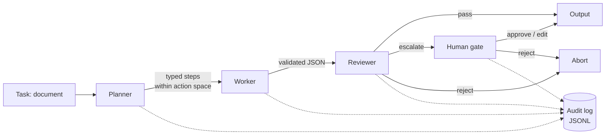
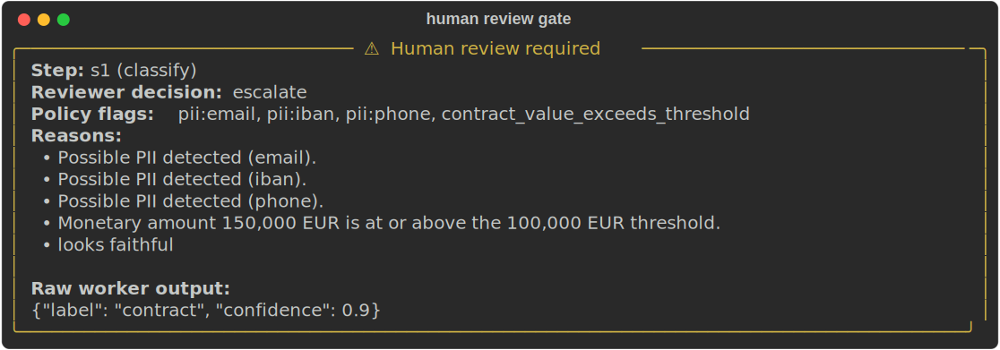
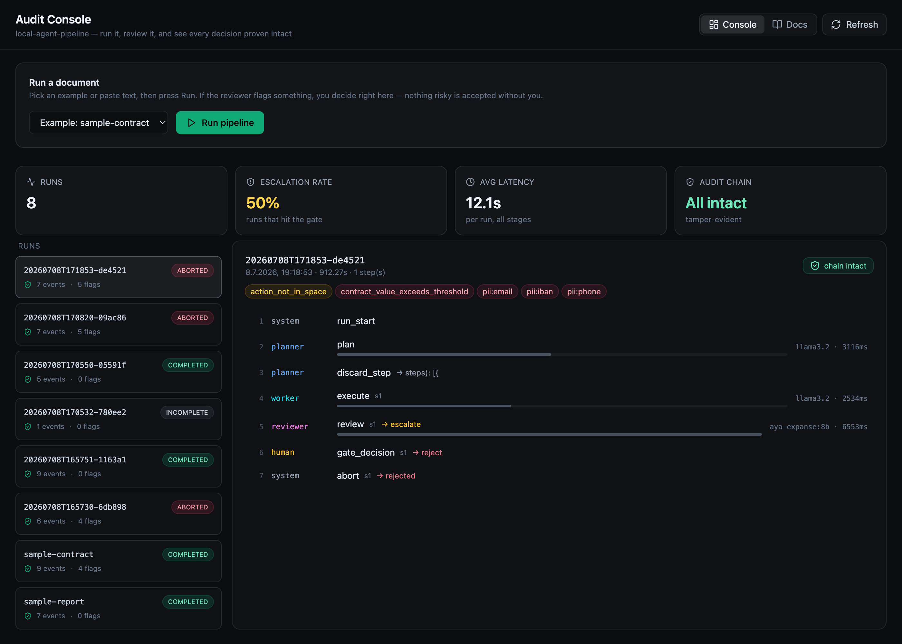
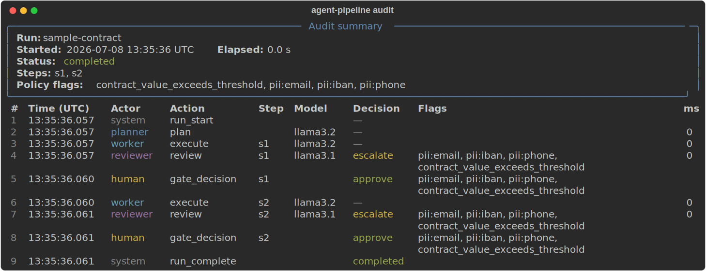

# local-agent-pipeline

[](https://github.com/leonkoellerwirth-arch/local-agent-pipeline/actions/workflows/ci.yml)
[](https://opensource.org/licenses/MIT)
[](https://www.python.org/downloads/)

A minimal, fully local multi-agent pipeline that treats auditability and human
oversight as first-class features — not afterthoughts.

It demonstrates how to build AI agents that are **controllable from the start**:
a planner/worker/reviewer pattern, a whitelisted action space, structured audit
logging of every step, policy guardrails, and a human-in-the-loop gate for
risky actions. It runs fully locally on [Ollama](https://ollama.com) by default
— nothing leaves the machine unless you explicitly route a role to an external
provider for stronger review (see [External review](#external-review-optional)),
and when you do, the audit trail records exactly which model decided.

> This is a **reference pattern**, not a production system. It is deliberately
> small so every file can be explained in a few minutes. Treat it as a
> worked example of governance-ready agent design, not a drop-in service.

**This is not a framework, and it does not compete with LangGraph, CrewAI, or
AutoGen.** It is the opposite: a single-responsibility-per-file reference you can
read end to end in one sitting, showing what auditable, human-gated agent design
looks like once the framework machinery is stripped away. If you need to ship,
reach for a framework. If you need to *understand, defend, and prove* the control
points — the audit trail, the action-space limit, the escalation gate — read
this. See [Why not just use a framework?](#why-not-just-use-a-framework) below.

The demonstration use case is a *document intake agent*: it classifies an
incoming text document, extracts key facts into structured JSON, and summarizes
it — and escalates to a human the moment a risk trigger fires (detected PII, a
contract value over a threshold, or low model confidence).

## Architecture



The audit log is a cross-cutting concern: **every** transition — plan, execute,
review, gate decision, discard, abort — writes exactly one JSONL event. No step
happens off the record.

| Stage | File | Responsibility |
|-------|------|----------------|
| Planner | `planner.py` | Decompose the task into ≤5 typed steps; discard any action outside the whitelist. |
| Worker | `worker.py` | Execute one step; return validated JSON; one retry on parse failure, then abort. |
| Reviewer | `reviewer.py` | Independent second model + policy heuristics; verdict is `pass`/`escalate`/`reject`. |
| Gate | `gate.py` | Pause on `escalate`; a human approves, rejects, or edits. `PolicyGate` for CI. |
| Audit | `audit.py` | One JSONL event per transition. |
| Contracts | `contracts.py` | Pydantic models that every stage speaks in. |

## Quickstart

**One command** (macOS/Linux): creates a virtualenv, installs the package, pulls
the Ollama models, runs the tests, and does a demo — after installing
[Ollama](https://ollama.com/download):

```bash
./setup.sh                 # add --skip-models or --no-demo to trim it
```

Or do it by hand:

```bash
# 1. Install Ollama and pull the default models (small, run on modest hardware)
#    https://ollama.com/download
ollama pull llama3.2
ollama pull llama3.1

# 2. Install the pipeline (needs Python >= 3.11)
pip install -e .

# 3. Run the benign example — it passes straight through
agent-pipeline run --input examples/sample-report.txt

# 4. Run the contract example — it deliberately trips the risk triggers
#    (PII + a contract value over the threshold) and pauses at the human gate
agent-pipeline run --input examples/sample-contract.txt

# 5. Run the same example non-interactively (for CI or scripts).
#    Escalations are auto-rejected; the audit trail records actor=system.
agent-pipeline run --input examples/sample-contract.txt --non-interactive
```

Every run writes an audit trail to `runs/<run_id>.jsonl`.

When the contract example trips a risk trigger, the run pauses and a human sees
this before anything is accepted:



Models, timeouts, and retry behaviour live in `config/pipeline.yaml`; the
guardrails (action space, PII patterns, thresholds, escalation rules) live in
`config/policy.yaml`. There are **no magic numbers in the code** — change
behaviour by editing YAML.

> The bundled PII regexes are a **demo guardrail**, not a compliance-grade
> detector: they illustrate deterministic risk triggers feeding the human gate,
> and will both miss real PII and raise false positives. A clean pass is not a
> privacy guarantee — use a dedicated, tested library for real detection.

## External review (optional)

Every role runs on a local Ollama model by default. To route a role — typically
the reviewer — to a stronger external model, name the provider in
`config/pipeline.yaml` and put the key in `.env`:

```yaml
# config/pipeline.yaml
models:
  planner: llama3.2
  worker: llama3.2
  reviewer: openai:gpt-4o        # escalated review on a frontier model
```

```bash
cp .env.example .env             # setup.sh does this for you
# set the matching key in .env:
#   OPENAI_API_KEY=...     → openai:<model>
#   GEMINI_API_KEY=...     → gemini:<model>
#   ANTHROPIC_API_KEY=...  → claude:<model>
```

`agent-pipeline run` loads `.env` automatically. Any role accepts `ollama:`
(default), `openai:`, `gemini:`, or `claude:`. Providers are called over plain
HTTP — no SDKs enter the dependency tree. Because the audit trail's `model`
field carries the full `provider:model` ref, you can see at a glance which
decisions stayed local and which went to a cloud model. Without a key, the run
stays local; naming a provider whose key is missing fails loudly rather than
silently downgrading.

## Dashboard (optional)

A small local web console lets you **run the pipeline and review it from the
browser** — no terminal needed. Pick an example (or paste text), press Run, and
if the reviewer escalates, the run pauses and you approve / reject / edit right
there. It also visualises every past run: per-stage latencies, escalation rate,
policy flags, and the tamper-evidence status of each trail.

```bash
./setup.sh        # once, for the Python side (venv, models)
web/start.sh      # launches the audit API + the dashboard, opens the browser
```

It is a **Vite + React** frontend talking to a tiny standard-library Python API
(`web/api_server.py`). Reads reuse the pipeline's own `read_events`/`verify_chain`
(so the dashboard shows exactly what `agent-pipeline audit` would), and runs go
through the real `run_pipeline` with a browser-based gate — the same human
oversight the CLI has, moved to the web. No web framework, no Docker. The
frontend lives in `web/` and is entirely optional; the pipeline and CLI do not
depend on it.



The shot above is a real session over the bundled examples: the reviewer
(`aya-expanse:8b`) escalated a contract, a human rejected it at the gate, and
every trail still verifies — the **Audit Chain** tile reads *All intact*.

## Reading the audit trail

Use the built-in `audit` subcommand to print a formatted summary of any run:

```bash
agent-pipeline audit runs/<run_id>.jsonl
```

This prints a summary panel (run ID, elapsed time, final status, all policy
flags that fired) and an event table with actors, decisions, latencies, and
flags for each step. Here is the contract example's trail (rendered without a
live model — see [`examples/expected-outputs/`](examples/expected-outputs/)):



The trail is **tamper-evident**: every event is hash-chained to the one before
it with a full SHA-256 digest (over the event's content *and* the previous
event's hash). Verify that a trail has not been edited, truncated, or reordered:

```bash
agent-pipeline audit runs/<run_id>.jsonl --verify
# ✓ Audit chain intact — chain intact across 12 events
# (exits non-zero and names the first broken event if the trail was altered)
```

**Optionally tamper-*resistant*, too.** The hash chain detects edits, but anyone
can recompute it. For an integrity guarantee that survives a determined forger,
set a secret key in the environment named by `audit.hmac_key_env` (default
`AUDIT_HMAC_KEY`). Each closed trail is then sealed with an HMAC-SHA256 over its
chain head, written to a sidecar `<run_id>.jsonl.sig`. Without the key, no one
can forge a valid seal — even after re-chaining edited events. The key lives only
in the environment, never in the config or the repo; leave it unset and trails
are simply unsigned (the chain is still tamper-evident).

```bash
AUDIT_HMAC_KEY=… agent-pipeline audit runs/<run_id>.jsonl --verify
# ✓ Audit chain intact — chain intact across 12 events
# ✓ HMAC seal valid — trail authenticated with the shared key.
```

For programmatic access, each line of `runs/<run_id>.jsonl` is one raw event.
A contract run reads like this (abbreviated):

```jsonc
{"actor":"system",  "action":"run_start"}
{"actor":"planner", "action":"plan",    "model":"llama3.2", "prompt_hash":"sha256:33777eef…", "output_hash":"sha256:bdbb0915…"}
{"actor":"worker",  "action":"execute", "step_id":"s1", "model":"llama3.2", "confidence":0.9, "latency_ms":812}
{"actor":"reviewer","action":"review",  "step_id":"s1", "model":"llama3.1", "decision":"escalate",
 "policy_flags":["pii:email","pii:iban","pii:phone","contract_value_exceeds_threshold"]}
{"actor":"human",   "action":"gate_decision", "step_id":"s1", "decision":"approve",
 "gate_reason":"reviewed; values confirmed with counterparty"}
{"actor":"system",  "action":"run_complete", "decision":"completed"}
```

When `--non-interactive` is used, `actor` is `system` instead of `human` and
`policy_flags` includes `non_interactive_mode`, making automated decisions
unambiguous in the trail:

```jsonc
{"actor":"system", "action":"gate_decision", "step_id":"s1", "decision":"reject",
 "policy_flags":["pii:email","contract_value_exceeds_threshold","non_interactive_mode"]}
```

You can reconstruct the entire run from these events. The full JSONL schema is
the `AuditEvent` model in `contracts.py`.

### A note on privacy

By default the trail stores prompts and outputs only as **hashes**, so a log can
be shared or archived without leaking document contents. Set
`audit.dump_plaintext: true` in `config/pipeline.yaml` to also write the full
prompt/output text into a separate `dump_dir` — useful for debugging, opt-in for
exactly the reason you'd expect.

## Design decisions

- **The reviewer is a *second, different* model.** A model grading its own
  output is not a review. Running the check on a separate model (configurable in
  `pipeline.yaml`) makes the second opinion independent.
- **Audit events are JSONL, one per line.** Append-only, greppable, streamable,
  and trivially diffable. The schema is kept compatible with the `log_analyzer`
  in the sibling [`agentic-ai-governance-toolkit`](#related).
- **The audit trail is tamper-evident.** Each event is hash-chained to the
  previous one (`prev_hash`/`entry_hash`), so editing, deleting, or reordering
  any event breaks the chain. `agent-pipeline audit --verify` proves a trail is
  intact — turning "we log everything" into a claim you can actually check.
- **The planner is bound to a whitelisted action space.** The planner can only
  emit `classify`/`extract`/`summarize` steps; anything else is discarded and
  logged. An agent that cannot name an unapproved capability cannot invoke one.
- **Tests never touch Ollama.** All model calls go through one injectable
  backend, so the suite runs deterministically in CI with the model faked. The
  governance-critical logic — policy heuristics, escalation, audit completeness
  — is tested without a GPU.
- **Local by default, external review is opt-in.** No API keys and no data
  egress until you deliberately route a role to a cloud provider. When you do,
  it is one config line, the key lives in `.env`, and the audit trail records
  which provider/model made each decision — so "we sent this to OpenAI" is a
  provable, reviewable fact rather than a hidden one.

## Why not just use a framework?

If you are shipping, you probably should. This repo exists to make the control
points legible, not to replace LangGraph or CrewAI.

| | This repo | Full agent framework |
|---|---|---|
| **Goal** | Understand & defend the control points | Build & ship agents fast |
| **Size** | ~1.5k lines, one responsibility per file, zero provider SDKs | Large; deep dependency tree |
| **Audit trail** | First-class, tamper-evident, schema-stable | Add-on / your responsibility |
| **Human gate** | Explicit stage you can read | Interrupt/checkpoint machinery |
| **Action space** | Hard whitelist, violations logged | Convention, rarely enforced |
| **Onboarding** | Readable end to end in one sitting | Learn the framework first |
| **Right when** | Reviewing, teaching, proving governance | Production features & scale |

The human-gate and reviewer patterns here map directly onto framework
primitives (e.g. LangGraph's `interrupt`/checkpointing). The point is not that
they are novel — it is to show, in code you can hold in your head, *where* the
oversight belongs and *how* to prove it happened.

## Development

```bash
pip install -e ".[dev]"
ruff check . && ruff format --check .
pytest -q
```

CI (`.github/workflows/ci.yml`) runs ruff and pytest on every push and pull
request. The suite does not depend on a local model.

See [CONTRIBUTING.md](CONTRIBUTING.md) for the full development setup,
commit conventions, and PR expectations. Maintainers: [docs/SOP.md](docs/SOP.md)
covers adding policy rules, extending the action space, and keeping the audit
schema compatible with the sibling toolkit.

## How we work with this repo (session workflow)

The same governance discipline the pipeline applies to *agents* — nothing off
the record, decisions written down, a hard gate before anything is accepted — is
how the repo itself is developed. So work with an AI agent survives a fresh
session without drift, the repo keeps its own memory and a fixed ritual around
it.

**Three artefacts hold the state:**

| Artefact | Role |
|----------|------|
| [`BIBLE.md`](BIBLE.md) | The constitution: binding invariants (§2–§4) and an open **Decision register** (§6). An invariant is never violated; a needed choice that isn't covered is added to the register and asked — never improvised. |
| [`HANDOFF.md`](HANDOFF.md) | Newest-first session log. Each entry: **Done · Decided · Open/blocked · Next · Continuity warnings**. The next session starts by reading the top entry. |
| [`scripts/`](scripts/) | Deterministic truth — **no AI**. `state.sh` (branch/HEAD/LoC/tests/ruff), `gate.sh` (the hard pass/fail), `secure.sh` (committed & pushed?), `session-snapshot.sh` (seeds a new HANDOFF entry). |

**Three skills drive the ritual** (Claude Code slash-commands in
[`.claude/skills/`](.claude/skills/), wired via [`CLAUDE.md`](CLAUDE.md)):

| Skill | When | What it does |
|-------|------|--------------|
| `/session-start` | Opening any session | Runs the scripts, reads the newest `HANDOFF` entry + the `BIBLE` register, then briefs: where we are, last done, blocking decisions, next step, continuity warnings. **Reconstructs state before touching anything — no drift.** |
| `/project-state` | Quick status check | Just `state.sh` + gate/secure, with a short honest read. No full reconstruction. |
| `/session-stop` | Closing any session | Records decisions in `BIBLE`, rescues any chat-only idea into the `HANDOFF` entry, runs the hard gate, snapshots `HANDOFF`, then commits & pushes. **Nothing forgotten, nothing left half-done.** |

The rule that ties it together: **do not start substantive work while a blocking
`BIBLE` decision is open, the gate is red, or `secure.sh` reports unpushed work.**
All three files are also visible in the dashboard's **Docs** tab.

### Demo — a real session, start to finish

`/session-start` runs the deterministic scripts first. This is the real,
unedited output from this repo on a clean tree — copy it and run it yourself:

```console
$ ./scripts/state.sh
== local-agent-pipeline — state ==
branch: main   HEAD: 51cb039   uncommitted files: 0   commits ahead of origin: 0
source LoC (src/): 1542   test functions: 65   ruff: clean

$ ./scripts/gate.sh
== hard gate ==
  ✓ ruff check clean
  ✓ ruff format clean
  ✓ pytest green (offline)
  ✓ no TODO/FIXME in src/
  ✓ no customer-internal names
  ✓ no obvious secrets tracked
  ✓ internal brief not tracked
  ✓ web build (tsc + vite)

GATE: PASS

$ ./scripts/secure.sh
✓ working tree clean
✓ pushed — origin/main is up to date

SECURE: all saved
```

(`state.sh` also prints the recent-commits list, trimmed here.)

It then reads the top `HANDOFF.md` entry and the open `BIBLE.md` register and
briefs you — e.g. *"main @ 51cb039, gate PASS, all pushed; last done: session
continuity system; 3 open decisions, none blocking; next: merge dependabot PRs."*
You do the work, then `/session-stop` closes the loop:

```text
BIBLE.md     ← decisions recorded, register ticked
HANDOFF.md   ← new top entry (Done/Decided/Open/Next/Warnings)
gate.sh      → GATE: PASS   (else: fix before committing)
git          → granular conventional commits, pushed
secure.sh    → SECURE: all saved
```

The next `/session-start` reads exactly that entry — so a new session continues
from the proven state, not from memory of the chat.

## Related

This repo *implements* patterns; its sibling
[`agentic-ai-governance-toolkit`](https://github.com/leonkoellerwirth-arch/agentic-ai-governance-toolkit)
*describes* how to govern agents. The audit log format here is designed to feed
that project's `log_analyzer`.

## Author

Leon Köllerwirth Hlihel — <https://leonkoellerwirth.de>

Licensed under the MIT License. All example documents are fictional.
