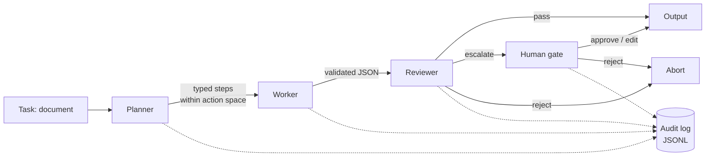

# local-agent-pipeline

A minimal, fully local multi-agent pipeline that treats auditability and human
oversight as first-class features — not afterthoughts.

It demonstrates how to build AI agents that are **controllable from the start**:
a planner/worker/reviewer pattern, a whitelisted action space, structured audit
logging of every step, policy guardrails, and a human-in-the-loop gate for
risky actions. Everything runs locally on [Ollama](https://ollama.com); no data
leaves the machine.

> This is a **reference pattern**, not a production system. It is deliberately
> small so every file can be explained in a few minutes. Treat it as a
> worked example of governance-ready agent design, not a drop-in service.

The demonstration use case is a *document intake agent*: it classifies an
incoming text document, extracts key facts into structured JSON, and summarizes
it — and escalates to a human the moment a risk trigger fires (detected PII, a
contract value over a threshold, or low model confidence).

## Architecture



The audit log is a cross-cutting concern: **every** transition — plan, execute,
review, gate decision, discard, abort — writes exactly one JSONL event. No step
happens off the record.

| Stage | File | Responsibility |
|-------|------|----------------|
| Planner | `planner.py` | Decompose the task into ≤5 typed steps; discard any action outside the whitelist. |
| Worker | `worker.py` | Execute one step; return validated JSON; one retry on parse failure, then abort. |
| Reviewer | `reviewer.py` | Independent second model + policy heuristics; verdict is `pass`/`escalate`/`reject`. |
| Gate | `gate.py` | Pause on `escalate`; a human approves, rejects, or edits. |
| Audit | `audit.py` | One JSONL event per transition. |
| Contracts | `contracts.py` | Pydantic models that every stage speaks in. |

## Quickstart

```bash
# 1. Install Ollama and pull the default models (small, run on modest hardware)
#    https://ollama.com/download
ollama pull llama3.2
ollama pull llama3.1

# 2. Install the pipeline
pip install -e .

# 3. Run the benign example — it passes straight through
agent-pipeline run --input examples/sample-report.txt

# 4. Run the contract example — it deliberately trips the risk triggers
#    (PII + a contract value over the threshold) and pauses at the human gate
agent-pipeline run --input examples/sample-contract.txt
```

Every run writes an audit trail to `runs/<run_id>.jsonl`.

Models, timeouts, and retry behaviour live in `config/pipeline.yaml`; the
guardrails (action space, PII patterns, thresholds, escalation rules) live in
`config/policy.yaml`. There are **no magic numbers in the code** — change
behaviour by editing YAML.

## Reading the audit trail

Each line of `runs/<run_id>.jsonl` is one event: who acted, with which model,
how long it took, and what was decided. A contract run reads like this
(abbreviated):

```jsonc
{"actor":"system",  "action":"run_start"}
{"actor":"planner", "action":"plan",    "model":"llama3.2", "prompt_hash":"sha256:33777eef…", "output_hash":"sha256:bdbb0915…"}
{"actor":"worker",  "action":"execute", "step_id":"s1", "model":"llama3.2", "confidence":0.9, "latency_ms":812}
{"actor":"reviewer","action":"review",  "step_id":"s1", "model":"llama3.1", "decision":"escalate",
 "policy_flags":["pii:email","pii:iban","pii:phone","contract_value_exceeds_threshold"]}
{"actor":"human",   "action":"gate_decision", "step_id":"s1", "decision":"approve"}
{"actor":"system",  "action":"run_complete", "decision":"completed"}
```

You can reconstruct the entire run from this: the reviewer flagged PII and a
contract value over the threshold, escalated, and a human approved it before the
result was accepted. The full JSONL schema is the `AuditEvent` model in
`contracts.py`.

### A note on privacy

By default the trail stores prompts and outputs only as **hashes**, so a log can
be shared or archived without leaking document contents. Set
`audit.dump_plaintext: true` in `config/pipeline.yaml` to also write the full
prompt/output text into a separate `dump_dir` — useful for debugging, opt-in for
exactly the reason you'd expect.

## Design decisions

- **The reviewer is a *second, different* model.** A model grading its own
  output is not a review. Running the check on a separate model (configurable in
  `pipeline.yaml`) makes the second opinion independent.
- **Audit events are JSONL, one per line.** Append-only, greppable, streamable,
  and trivially diffable. The schema is kept compatible with the `log_analyzer`
  in the sibling [`agentic-ai-governance-toolkit`](#related).
- **The planner is bound to a whitelisted action space.** The planner can only
  emit `classify`/`extract`/`summarize` steps; anything else is discarded and
  logged. An agent that cannot name an unapproved capability cannot invoke one.
- **Tests never touch Ollama.** All model calls go through one injectable
  backend, so the suite runs deterministically in CI with the model faked. The
  governance-critical logic — policy heuristics, escalation, audit completeness
  — is tested without a GPU.
- **Everything is local.** No API keys, no data egress. The point is that
  controllable agent design does not require a hosted model.

## Development

```bash
pip install -e ".[dev]"
ruff check . && ruff format --check .
pytest -q
```

CI (`.github/workflows/ci.yml`) runs ruff and pytest on every push and pull
request. The suite does not depend on a local model.

## Related

This repo *implements* patterns; its sibling
[`agentic-ai-governance-toolkit`](https://github.com/leonkoellerwirth-arch/agentic-ai-governance-toolkit)
*describes* how to govern agents. The audit log format here is designed to feed
that project's `log_analyzer`.

## Author

Leon Köllerwirth Hlihel — <https://leonkoellerwirth.de>

Licensed under the MIT License. All example documents are fictional.
